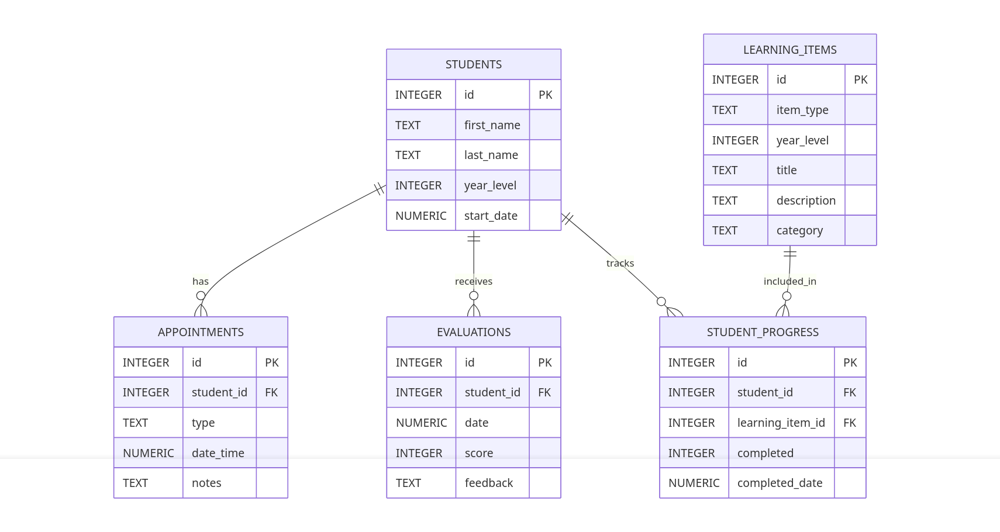

# Clinical-Database

## Scope

The database for my CS50 SQL final project named `Clinical Database` includes all entities necessary to facilitate the process of tracking nursing students on a ward, their learning items based on year level, appointments, and evaluations. As such, included in the database's scope is:

* Students, including basic identifying information and year level
* Learning items, categorized by year level
* Appointments, including type and time
* Evaluations, including scores and feedback
* Student progress tracking, linking students to learning items they've completed

Out of scope are elements like detailed personal medical records, complex scheduling systems, and multi-ward management.

## Functional Requirements

This database will support:

* CRUD operations for students and their information
* Tracking what each student should learn based on their year level
* Managing appointments (shifts, meetings, training sessions)
* Recording and reviewing evaluations
* Viewing students currently assigned to the ward

## Representation

Entities are captured in SQLite tables with the following schema.

### Entities

The database includes the following entities:

#### Students

The `students` table includes:
* `id`, which specifies the unique ID for the student as an `INTEGER`. This column thus has the `PRIMARY KEY` constraint applied.
* `first_name`, which specifies the student's first name as `TEXT`, given `TEXT` is appropriate for name fields.
* `last_name`, which specifies the student's last name. `TEXT` is used for the same reason as `first_name`.
* `year_level`, which specifies the student's current year (1, 2, or 3) as `INTEGER`.
* `start_date`, which specifies when the student began on the ward.

#### Learning Items

The `learning_items` table replaces separate tables for objectives and procedures, combining both into a single entity:
* `id`, which specifies the unique ID for the learning item as an `INTEGER`. This column thus has the `PRIMARY KEY` constraint applied.
* `item_type`, which specifies whether the item is an 'objective' (theoretical learning goal) or 'procedure' (practical skill) as `TEXT`.
* `year_level`, which is an `INTEGER` specifying which year this item applies to (1, 2, or 3).
* `title`, which is the title of the learning item as `TEXT`.
* `description`, which provides additional details about the item as `TEXT`.
* `category`, which categorizes objectives (e.g., 'Clinical Skills', 'Theory', 'Communication').

A check constraint ensures that objectives have a category set, while procedures require no additional classification.

#### Student Progress

The `student_progress` table tracks which learning items each student has completed:
* `id`, which specifies the unique ID for the progress record as an `INTEGER`. This column thus has the `PRIMARY KEY` constraint applied.
* `student_id`, which is the ID of the student as an `INTEGER`. This column has a `FOREIGN KEY` constraint referencing the `id` column in the `students` table.
* `learning_item_id`, which is the ID of the learning item as an `INTEGER`. This column has a `FOREIGN KEY` constraint referencing the `id` column in the `learning_items` table.
* `completed`, which is an `INTEGER` (0 or 1) indicating whether the item has been completed.
* `completed_date`, which records when the item was completed.

A unique constraint prevents duplicate progress records for the same student and learning item.

#### Appointments

The `appointments` table includes:
* `id`, which specifies the unique ID for the appointment as an `INTEGER`. This column thus has the `PRIMARY KEY` constraint applied.
* `student_id`, which is the ID of the student who has the appointment as an `INTEGER`. This column thus has the `FOREIGN KEY` constraint applied, referencing the `id` column in the `students` table.
* `type`, which specifies the type of appointment (e.g., 'Shift', 'Meeting', 'Training') as `TEXT`.
* `date_time`, which is the timestamp for when the appointment occurs.
* `notes`, which contains any additional notes about the appointment as `TEXT`.

All columns except `notes` are required.

#### Evaluations

The `evaluations` table includes:
* `id`, which specifies the unique ID for the evaluation as an `INTEGER`. This column thus has the `PRIMARY KEY` constraint applied.
* `student_id`, which is the ID of the student being evaluated as an `INTEGER`. This column thus has the `FOREIGN KEY` constraint applied, referencing the `id` column in the `students` table.
* `date`, which is the date the evaluation was conducted.
* `score`, which is the evaluation score as an `INTEGER` from 1 to 5.
* `feedback`, which contains the evaluation feedback as `TEXT`.

All columns except `feedback` are required. The `score` column has an additional constraint to check if its value is between 1 and 5.

### Relationships

* One student has 0 to many appointments. 0 if they have no scheduled appointments, and many if they have multiple appointments.
* One student has 0 to many evaluations. 0 if they haven't been evaluated yet, and many if they have multiple evaluations.
* Learning items are associated with year levels, not directly with students. A year level (1, 2, or 3) has 1 to many learning items.
* Students and learning items have a many-to-many relationship, implemented via the `student_progress` table. A student can complete multiple learning items, and each learning item can be completed by multiple students.

## Optimizations

Per the typical queries in `queries.sql`, it is common for users of the database to access all students by year level. For that reason, an index is created on the `year_level` column to speed the identification of students by year.

Indexes are also created on foreign key columns such as `student_id` in the `appointments`, `evaluations`, and `student_progress` tables to improve performance of common JOIN operations.

Similarly, it is also common practice to search for appointments by date, so an index is created on the `date_time` column in the `appointments` table.

## Limitations

The current design tracks completion of learning items as binary (completed/not completed) but doesn't track partial progress, multiple attempts, or proficiency levels. A future version could include more granular progress tracking (e.g., "needs practice", "proficient", "expert") and record detailed notes for each attempt.

The schema assumes a single ward. For tracking across multiple wards or hospital departments, a `wards` or `departments` table would need to be added with appropriate foreign key relationships.

